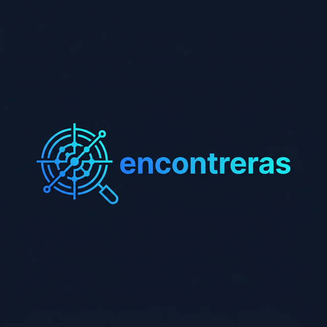

# encontreras 🎯 | Aprende a construir tu primer Agente Autónomo B2B

<p align="center">
  
</p>

<p align="center">
  <strong>Proyecto educativo Open-Source para aprender a extraer, enriquecer y calificar prospectos con IA.</strong><br>
  <em>100% local, 100% gratis, 0 código en la nube de terceros.</em>
</p>

<p align="center">
  <a href="#cómo-funciona-el-pipeline">Arquitectura</a> ·
  <a href="#-quickstart-5-minutos">Quickstart</a> ·
  <a href="#-fase-2-inteligencia-artificial--notion">IA & Notion</a> ·
  <a href="#english-version">English</a>
</p>

---

## 🎯 ¿Para qué sirve este repositorio?

**Encontreras no es un producto comercial ni un SaaS.** Es un entorno educativo diseñado para que aprendas cómo interactúan herramientas modernas de automatización (Playwright) y bases de datos locales (SQLite) con Modelos de Lenguaje Grande (Google Gemini Flash) para resolver un problema real: **la prospección de ventas B2B**.

La mayoría de los tutoriales de IA se quedan en chatbots básicos. Este proyecto te enseña a construir un pipeline asíncrono que "ve" el internet, audita sitios web y redacta  **Icebreakers** (*Rompehielos*) hiper-personalizados, dándote control total de tus datos al exportarlos a CSV o conectarlos directamente con Notion.

**Ideal para**: Desarrolladores Jr/Mid que quieren aprender sobre Agentes Autónomos, o profesionales no técnicos que quieren bajar el repositorio a sus computadoras para automatizar sus ventas sin pagar costosas suscripciones.

---

## ¿Cómo Funciona? (El Pipeline)

```
Google Maps → Web Audit → Social Check → Dedup → Score → IA → Notion
```

1. **Scraping (Google Maps)**: Extrae nombre, teléfono, dirección, horarios, categoría, reseñas y nivel de precio.
2. **Auditoría Web**: Navega automáticamente al sitio del negocio. Extrae emails, encuentra redes sociales, y evalúa la salud del sitio (¿está caída? ¿falta el H1? ¿no es mobile-friendly?).
3. **Termómetro Social**: Visita Instagram, TikTok y Facebook para extraer conteo de seguidores.
4. **Deduplicación**: Fusiona duplicados usando teléfono y dominio web como llaves únicas.
5. **Lead Scoring**: Califica de 0 (spam) a 5 (excelente) según completitud de datos y presencia digital.
6. **Síntesis IA** *(opcional)*: Gemini Flash analiza cada lead y genera un contexto, análisis y DM personalizado.
7. **Notion Sync** *(opcional)*: Exporta los leads listos a tu CRM en Notion.

---

## 📋 Requisitos

- **Python** 3.10+ ([descargar](https://www.python.org/downloads/))
- **Git** ([descargar](https://git-scm.com/downloads))
- **macOS, Linux o WSL** (Windows via WSL)
- ~500 MB de espacio (para Playwright/Chromium)

---

## 🤖 Para No Programadores (Uso con 1-Clic)

Si no sabes programar y no quieres lidiar con comandos en la terminal, no te preocupes. Hemos preparado instaladores de un solo clic que descargan lo necesario, prenden la terminal detrás de escenas y abren la página web automáticamente.

Solo asegúrate de **[Descargar e instalar Python 3.10+](https://www.python.org/downloads/)** primero (en Windows, marca la casilla *"Add python.exe to PATH"* durante la instalación).

Luego:
1. Descarga este repositorio usando el botón verde **"Code" -> "Download ZIP"** arriba a la derecha.
2. Descomprime la carpeta.
3. Haz **doble clic** en:
   - 🍎 **`start.command`** (Si estás en Mac o Linux)
   - 🪟 **`start.bat`** (Si estás en Windows)
4. ¡Listo! Espera un minuto a que la pantalla negra descargue los navegadores invisibles (solo la primera vez). Cuando acabe, tu navegador se abrirá mostrando `http://localhost:8888`.

---

## ⚡ Quickstart para Desarrolladores (Terminal)

### Opción A: Con Make (recomendado para Unix)
```bash
git clone https://github.com/fercreek/encontreras.git
cd encontreras
make install    # Crea venv, instala deps y Chromium
make serve      # Dashboard en http://localhost:8888
```

En otra terminal:
```bash
make worker     # Levanta el worker de tareas
```

Ahora puedes buscar leads desde el Dashboard o desde la terminal:
```bash
make run q="dentistas" l="Monterrey"
```

### Opción B: Manual
```bash
git clone https://github.com/tuusuario/encontreras.git
cd encontreras
python3 -m venv .venv
source .venv/bin/activate
pip install -e .
playwright install chromium

# Extraer leads
python main.py run --query "dentistas" --location "Monterrey" --max-results 10

# Ver resultados
python main.py serve --reload
```

### 🤖 Uso desde el Dashboard
El Dashboard web te permite lanzar extracciones directamente desde el formulario visual. Solo necesitas tener el **worker** corriendo en otra terminal:
```bash
make worker
# o: .venv/bin/huey_consumer src.core.tasks.huey
```

---

## 🧠 Fase 2: Inteligencia Artificial & Notion

### Configurar Variables de Entorno

```bash
cp .env.example .env
```

Abre `.env` y pega tus llaves:

#### 🔑 `GEMINI_API_KEY` — Google AI Studio (Gratis)
1. Ve a **[aistudio.google.com/apikey](https://aistudio.google.com/apikey)**
2. Inicia sesión con tu cuenta de Google
3. Clic en **"Create API Key"** → selecciona o crea un proyecto
4. Copia la llave (empieza con `AIza...`)

> 💡 El tier gratuito incluye ~15 requests/min y ~1M tokens/día. Más que suficiente.

#### 🔑 `NOTION_TOKEN` — Integración de Notion *(opcional)*
1. Ve a **[notion.so/profile/integrations](https://www.notion.so/profile/integrations)**
2. Crea una nueva integración llamada `encontreras-sync`
3. Dale permisos de **Leer**, **Insertar** y **Actualizar contenido**
4. Copia el Secret (empieza con `ntn_...`)
5. ⚠️ Conecta la integración a tu base de datos: `•••` → **Conexiones** → `encontreras-sync`

#### 🔑 `NOTION_DATABASE_ID` — ID de tu base de datos
1. Abre tu base de datos en Notion **en el navegador**
2. El ID es la cadena de 32 caracteres en la URL entre el último `/` y el `?`

### Ejecutar la IA
```bash
make synthesize     # Gemini analiza leads con Score ≥ 3
make notion-sync    # Sube los analizados a Notion
```

---

## 🗂️ Estructura del Proyecto

```
encontreras/
├── main.py                    # CLI principal (Typer)
├── Makefile                   # Atajos: make run, make serve, etc.
├── pyproject.toml             # Dependencias Python
├── .env.example               # Template de variables de entorno
│
├── src/
│   ├── pipeline.py            # Orquestador del flujo completo
│   ├── core/
│   │   ├── config.py          # Constantes, regex, blacklists
│   │   ├── models.py          # Dataclass Business
│   │   ├── database.py        # SQLite init + UPSERT
│   │   ├── entity_resolution.py
│   │   ├── lead_scorer.py     # Score heurístico 0-5
│   │   ├── ai_synthesis.py    # Gemini Flash prompts
│   │   ├── notion_sync.py     # Push a Notion API
│   │   ├── tasks.py           # Cola de tareas Huey
│   │   └── exporter.py        # CSV/JSON export
│   └── extractors/
│       ├── google_maps.py     # Playwright scraper
│       ├── website.py         # Email + social + health
│       └── social.py          # IG/TK/FB followers
│
├── web/
│   ├── index.html             # Dashboard UI
│   ├── app.js                 # Frontend logic
│   ├── style.css              # Dark theme
│   ├── server.py              # HTTP server + API
│   └── favicon.png            # Logo
│
└── output/
    └── encontreras.db         # Base de datos SQLite (auto-generada)
```

---

## 🛠️ Todos los Comandos

| Comando | Descripción |
|---|---|
| `make install` | Setup completo desde cero |
| `make run q="tacos" l="CDMX"` | Extrae leads |
| `make run-visible q="..." l="..."` | Extrae con navegador visible |
| `make serve` | Dashboard en `:8888` |
| `make worker` | Worker de tareas (Huey) |
| `make synthesize` | IA analiza prospectos |
| `make notion-sync` | Sube a Notion |
| `make help` | Ver todos los atajos |

---

## 🔒 Seguridad

- **Tus API keys nunca se suben a Git**: `.env` está en `.gitignore`
- **Sin servidores externos**: Todo corre en tu máquina local
- **Sin tracking**: No recopilamos datos de uso ni telemetría
- **Datos locales**: Tu base de datos SQLite vive en `output/` (también gitignored)

---

## 🤝 ¿Quieres contribuir?

1. Haz un fork del proyecto
2. Crea una rama: `git checkout -b mi-feature`
3. Haz tus cambios y commitea: `git commit -m "feat: mi mejora"`
4. Sube tu rama: `git push origin mi-feature`
5. Abre un Pull Request

Ideas de contribución:
- 🌍 Soporte para scraping en otros países (ajustar selectores)
- 📊 Más métricas en el Dashboard (gráficas, exportar desde la web)
- 🤖 Soporte para otros LLMs (OpenAI, Anthropic, Ollama local)
- 🧪 Tests automatizados para los módulos de Fase 2

---

## 📜 Licencia

MIT — Úsalo, modifícalo, distribúyelo libremente.

---

# English Version

**Encontreras** is a free, open-source autonomous agent for B2B lead generation. It scrapes Google Maps, audits websites, checks social media presence, scores leads, and uses AI to draft personalized cold messages — all running locally on your machine.

## ⚡ Quick Start

```bash
git clone https://github.com/tuusuario/encontreras.git
cd encontreras
make install         # Sets up venv, deps, and Chromium
make run q="dentists" l="Mexico City"   # Extract leads
make serve           # Dashboard at http://localhost:8888
```

For AI features, copy `.env.example` to `.env` and add your free [Gemini API key](https://aistudio.google.com/apikey):
```bash
cp .env.example .env
make synthesize      # AI analyzes your leads
```

## How It Works

```
Google Maps → Website Audit → Social Check → Dedup → Score → AI → Notion
```

1. **Scrape** business data from Google Maps (name, phone, address, reviews, etc.)
2. **Audit** their website for emails, social links, and technical health issues
3. **Check** their Instagram, TikTok, and Facebook follower counts
4. **Deduplicate** by phone number and web domain
5. **Score** each lead from 0 (spam) to 5 (excellent)
6. **Synthesize** with Gemini Flash AI to generate context and a personalized DM
7. **Sync** qualified leads to your Notion CRM

## All Commands

| Command | Description |
|---|---|
| `make install` | Full setup from scratch |
| `make run q="tacos" l="CDMX"` | Extract leads |
| `make serve` | Dashboard at `:8888` |
| `make worker` | Background task worker |
| `make synthesize` | AI analyzes prospects |
| `make notion-sync` | Push to Notion |
| `make help` | Show all shortcuts |

## Security

- API keys stay local (`.env` is gitignored)
- No external servers — everything runs on your machine
- No tracking or telemetry
- SQLite database stays in `output/` (also gitignored)

---

*MIT License · Made with 🎯 for the outbound sales community*
